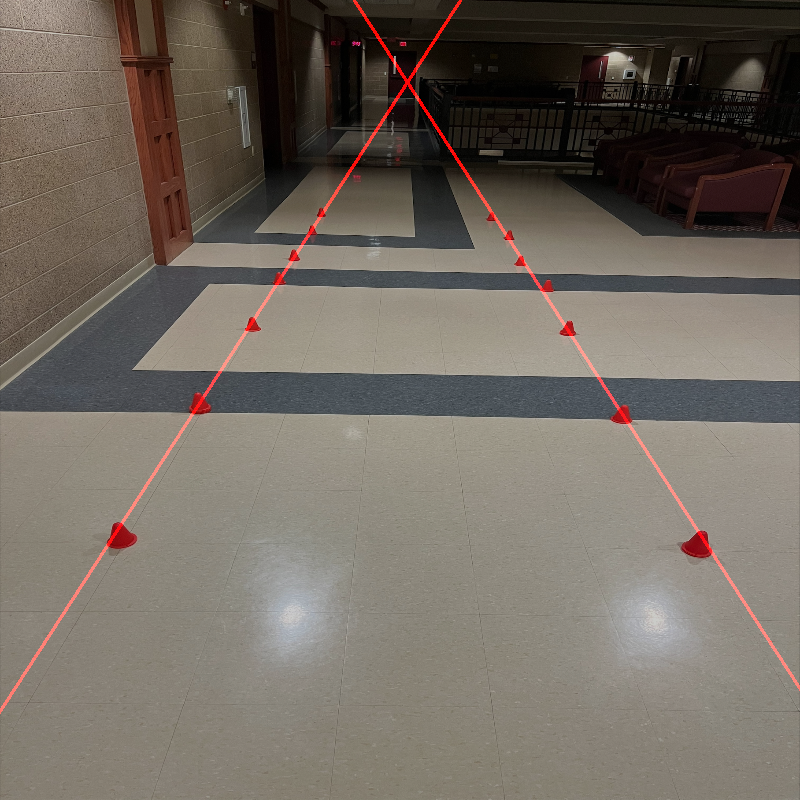

# OpenCV Project

## Methodology

1. Import the image and resize it for testing purposes. The image initially was larger than my screen, and when running the code, it was difficult to see the effects of the image manipulation during testing.

2. Create a color mask using `lower_orange` and `upper_orange`, which ended up being difficult to narrow down because the values are in HSV and not the traditional BGR scheme used by `cv2`. I found this somewhat helpful article on Stack Overflow about the process:
   [Stack Overflow Article](https://stackoverflow.com/questions/10948589/choosing-the-correct-upper-and-lower-hsv-boundaries-for-color-detection-with-cv)

3. Create a kernel that applies a blurring effect to the image by combining surrounding pixels.

4. Use the `cv2.morphologyEx()` method to close the gaps in the color mask. I found information about this on the official OpenCV website:
   [OpenCV Morphological Operations](https://docs.opencv.org/4.x/d9/d61/tutorial_py_morphological_ops.html)

5. Use the `cv2.Canny()` method to detect edges. I found this article about it on the official OpenCV documentation website:
   [OpenCV Canny Edge Detection](https://docs.opencv.org/4.x/da/d22/tutorial_py_canny.html) Essentially, the method checks for differences in the value of neighboring pixels.

6. Use the `cv2.HoughLinesP` method to detect lines in the image.
   [OpenCV Hough Line Detection](https://docs.opencv.org/3.4/d9/db0/tutorial_hough_lines.html)

7. Then I called the `draw_lines()` method.

8. Within the `draw_lines()` method, call the `np.zeros_like()` method, which creates a new NumPy array filled with zeros.

9. Loop over the lines detected earlier, filling the array with the values of the lines found.

10. Display the image with the lines drawn onto it.

## What Did You Try, and Why Do You Think It Did Not Work?
I originally tried to create the color mask using some values for orange I found online. Although this method just dident work. In the end I hand tweaked the values by pluggin in numbers, running the code and checking the results. 

This was one of the most important steps in the whole process because for the Canny edge detection process to work properly the cones have to be properly masked. 

Another difficult roadblock that I had to overcome in this porject was the tweaking of parameters in the Hough line detection method. Based off the documentation the parameters, especially `rho` and `theta` are slightly vauge. It took a while to eventually narrow down these parameters so that only two lines were created. 

## What Libraries Are Used?
For this project, I chose to use:
1. The OpenCV library called `cv2`.
2. The NumPy library called `numpy`.